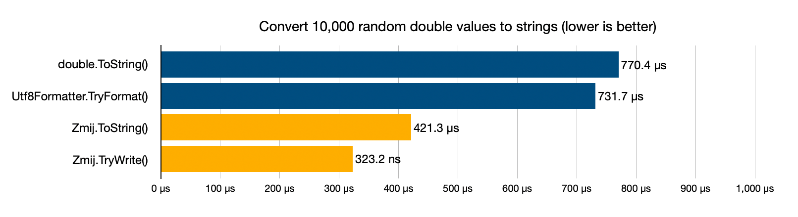

# Zmij.NET
C# port of Zmij, an extremely fast double-to-string conversion algorithm.



## Overview

Zmij.NET is a C# port of [Zmij](https://github.com/vitaut/zmij).

Zmij is a fast dtoa implementation by the author of the C++ `{fmt}` library. It is based on Schubfach and xjb and is even faster than fast dtoa algorithms such as Ryu and Dragonbox.

## Installation

### .NET CLI

```bash
dotnet add package Zmij
```

### Unity

In Unity, you can install Zmij.NET from [NuGetForUnity](https://github.com/GlitchEnzo/NuGetForUnity)

## Quick Start

```cs
using ZmijNet; // namespace

double value = 1.234567890123456;
Console.WriteLine(Zmij.ToString(value)); // 1.234567890123456

float single = 3.14f;
Console.WriteLine(Zmij.ToString(single)); // 3.14

Span<byte> buffer = stackalloc byte[20];
Zmij.TryWrite(value, buffer, out int bytesWritten);

ZmijDecimal d = Zmij.ToDecimal(value);
Console.WriteLine(d.Significand); // 12345678901234560
Console.WriteLine(d.Exponent);    // -16
Console.WriteLine(d.IsNegative);  // False
```

## Benchmarks

The following are benchmark results for converting 10,000 random `double` values ​​to `string` or `Span<byte>`.

| Method                |     Mean |    Error |   StdDev |
| --------------------- | -------: | -------: | -------: |
| System_DoubleToString | 770.4 us | 14.73 us | 12.30 us |
| System_Utf8Formatter  | 731.7 us | 13.77 us | 12.21 us |
| Zmij_ToString         | 421.3 us |  8.29 us | 12.16 us |
| Zmij_TryWrite         | 323.2 us |  3.97 us |  3.52 us |

## License

This repository is under the [MIT License](LICENSE).

Please refer to the Żmij license here: 
https://github.com/dtolnay/zmij/blob/master/LICENSE-MIT
